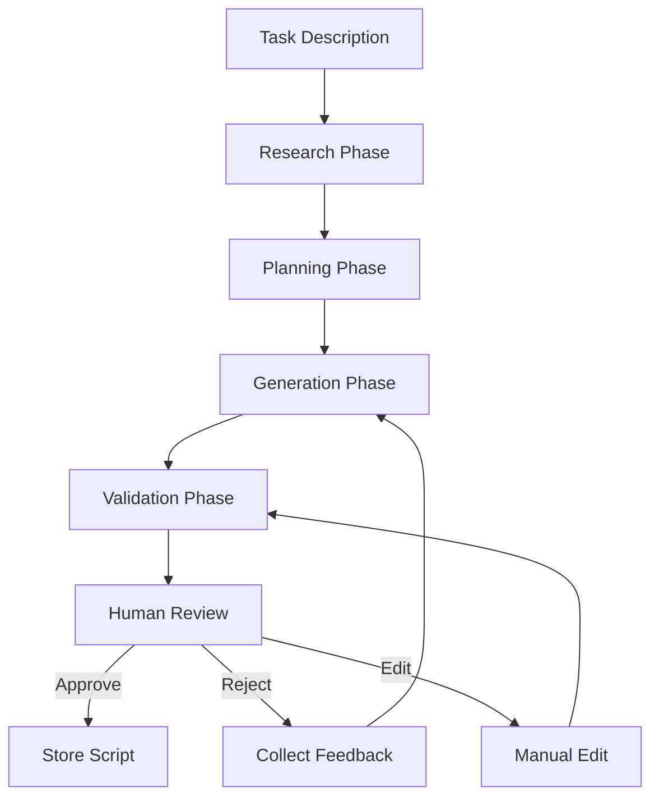
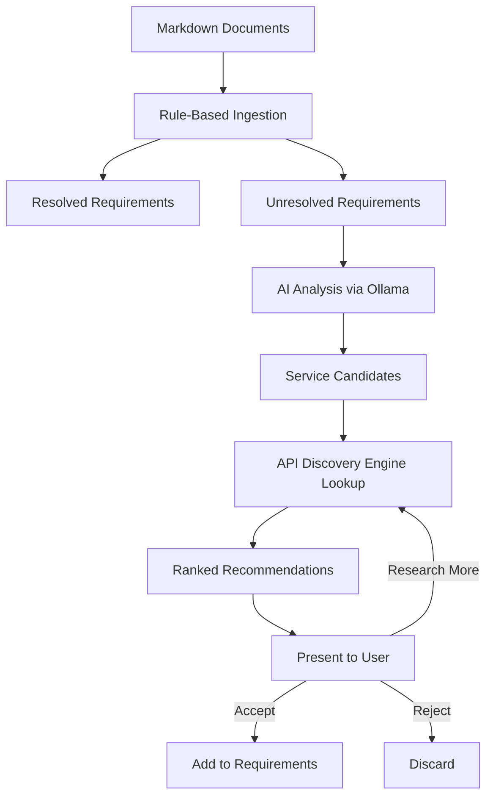

# AI-Powered Script Generation System Specification

This document specifies how KeyClave uses locally running AI models to autonomously create Playwright browser automation scripts for tasks including account creation, payment method configuration, billing restriction adjustments, and API key management.

**Status:** Post-MVP extension. Part of the automation subsystem.

Related:

- Automation architecture: [`plans/automation-subsystem-architecture.md`](plans/automation-subsystem-architecture.md:1)
- Playwright engine: [`plans/playwright-automation-engine.md`](plans/playwright-automation-engine.md:1)
- Local LLM inference: [`plans/local-llm-inference.md`](plans/local-llm-inference.md:1)
- Markdown ingestion: [`plans/markdown-ingestion.md`](plans/markdown-ingestion.md:1)
- Security boundaries: [`plans/security-crypto-2fa.md`](plans/security-crypto-2fa.md:1)

## 1) Goals

- Autonomously generate Playwright scripts from API service documentation
- Research provider documentation to extract step-by-step procedures
- Translate procedures into executable, checkpoint-annotated scripts
- Leverage Markdown requirement documents to identify API needs and recommend services
- Maintain a local reference library of automation patterns for AI context

## 2) Non-goals

- No cloud-hosted LLM usage
- No autonomous execution of generated scripts without human review
- No storage of secrets in generated scripts
- No fine-tuning of models within the application

## 3) LLM backend

### 3.1 Primary: Ollama

Ollama is the primary backend for all AI script generation tasks:

- Communication via local HTTP API at `http://localhost:11434`
- KeyClave manages model lifecycle through Ollama's API:
  - `GET /api/tags` — list available models
  - `POST /api/pull` — download models
  - `POST /api/generate` — single-turn generation
  - `POST /api/chat` — multi-turn conversation for complex tasks
- Recommended model: **Qwen2.5-Coder 7B** for code generation tasks
- Alternative: **Qwen2.5 7B Instruct** for documentation analysis

### 3.2 Fallback: bundled llama.cpp

If Ollama is not installed or not running:

- Fall back to the bundled llama.cpp runtime per [`plans/local-llm-inference.md`](plans/local-llm-inference.md:40)
- Use the same model family in GGUF format
- Reduced capability but functional for basic script generation

### 3.3 Model selection for tasks

| Task | Recommended model | Minimum model |
|---|---|---|
| Script generation | Qwen2.5-Coder 7B | Qwen2.5 7B Q4_K_M |
| Documentation analysis | Qwen2.5 7B Instruct | Qwen2.5 7B Q4_K_M |
| Service recommendations | Qwen2.5 7B Instruct | Qwen2.5 7B Q4_K_M |
| Selector repair | Qwen2.5-Coder 7B | Qwen2.5 7B Q4_K_M |

## 4) Script generation pipeline

### 4.1 Pipeline overview



### 4.2 Research phase

The AI researches the target service before generating scripts:

1. **Check reference library**: search local Playwright/Puppeteer examples for similar tasks
2. **Parse provider documentation**: fetch and analyze the provider's API docs and dashboard help pages
3. **Extract procedures**: identify step-by-step instructions for the target task
4. **Identify form fields**: map required inputs, selectors, and expected responses
5. **Note authentication requirements**: determine how the service authenticates users

Research output is a structured document:

```python
@dataclass
class ResearchResult:
    provider_id: str
    task_type: str  # account_creation, payment_config, billing_restriction, api_key_management
    documentation_urls: list[str]
    steps: list[ProcedureStep]
    form_fields: list[FormField]
    auth_method: str  # api_key, oauth, session_cookie, manual_login
    warnings: list[str]  # potential issues identified
    confidence: float  # 0.0-1.0
```

### 4.3 Planning phase

The AI creates an execution plan from the research:

1. **Map steps to Playwright actions**: translate each procedure step to page actions
2. **Identify HITL checkpoints**: mark steps that require human approval
3. **Plan error handling**: define recovery strategies for each step
4. **Estimate execution time**: provide rough timing for user expectation
5. **Identify dependencies**: note required inputs like API keys, account credentials

Plan output:

```python
@dataclass
class ScriptPlan:
    task_description: str
    provider_id: str
    steps: list[PlannedStep]
    checkpoints: list[CheckpointDefinition]
    required_inputs: list[InputRequirement]
    estimated_duration_seconds: int
    risk_level: str  # low, medium, high
```

### 4.4 Generation phase

The AI generates a complete Playwright script:

1. **Generate script skeleton**: imports, setup, teardown
2. **Implement each step**: translate planned steps to Playwright code
3. **Inject HITL checkpoints**: add checkpoint calls at marked positions
4. **Add error handling**: try/except blocks with recovery logic
5. **Add logging**: audit trail entries for each action
6. **Add assertions**: verify expected state after each step

Generated scripts follow a standard template:

```python
# Template structure - not actual code
class AutomationScript:
    metadata: ScriptMetadata  # provider, task, version, generated_at
    
    async def setup(self, context): ...
    async def execute(self, context): ...
    async def teardown(self, context): ...
    async def on_error(self, context, error): ...
```

### 4.5 Validation phase

Before presenting to the user, the generated script is validated:

1. **Syntax check**: parse the Python AST to verify valid syntax
2. **Security scan**: check for:
   - No hardcoded secrets or credentials
   - No unauthorized network access outside provider domains
   - No file system access outside allowed directories
   - All HITL checkpoints present for critical actions
3. **Completeness check**: verify all planned steps are implemented
4. **Dry run** (optional): execute against a mock browser context to verify basic flow

## 5) Task types and templates

### 5.1 Account creation

Steps the AI generates for account creation:

1. Navigate to provider signup page
2. **HITL checkpoint**: confirm account creation intent
3. Fill registration form (user provides details at checkpoint)
4. Handle email verification if required
5. **HITL checkpoint**: confirm email verification completed
6. Navigate to API key creation page
7. **HITL checkpoint**: confirm API key scope and permissions
8. Extract generated API key
9. Store key in vault

### 5.2 Payment method configuration

Steps for payment method setup:

1. Navigate to provider billing page
2. **HITL checkpoint**: display current billing status, confirm intent to modify
3. Navigate to payment method section
4. **HITL checkpoint**: confirm payment method details (user enters in browser)
5. Verify payment method was added successfully
6. **HITL checkpoint**: confirm final billing configuration

### 5.3 Billing restriction adjustments

Steps for modifying billing restrictions:

1. Navigate to provider billing/usage page
2. Extract current restrictions and limits
3. **HITL checkpoint**: display current vs proposed restrictions, confirm changes
4. Apply restriction changes
5. Verify changes were applied
6. **HITL checkpoint**: confirm final state

### 5.4 API key management

Steps for key creation, rotation, or deletion:

1. Navigate to provider API key management page
2. Extract current key list and permissions
3. **HITL checkpoint**: confirm intended action with details
4. Execute key action (create/rotate/delete)
5. If creating: extract new key value
6. **HITL checkpoint**: confirm key was captured correctly
7. Update vault with new key data

## 6) Markdown analysis module

### 6.1 Purpose

Parse requirement documents to identify API needs without specified services, then generate service recommendations.

### 6.2 Integration with existing ingestion

Extends the rule-based pipeline from [`plans/markdown-ingestion.md`](plans/markdown-ingestion.md:70):

1. **Existing pipeline** identifies explicit provider references and env vars
2. **AI augmentation** analyzes unresolved requirements:
   - Functional descriptions like "need image processing API" without naming a service
   - Generic capability references like "payment processing" or "email delivery"
   - Architecture descriptions that imply API dependencies

### 6.3 Service recommendation flow



### 6.4 Recommendation output

```python
@dataclass
class ServiceRecommendation:
    requirement_text: str          # original text from markdown
    capability_needed: str         # normalized capability description
    recommended_services: list[RecommendedService]
    confidence: float
    citation: Citation             # from markdown-ingestion Citation model

@dataclass
class RecommendedService:
    provider_id: str               # existing or proposed provider
    service_name: str
    rationale: str                 # why this service fits
    pricing_summary: str           # from discovery engine cache
    free_tier_available: bool
    documentation_url: str
    match_score: float             # 0.0-1.0
```

## 7) Reference library management

### 7.1 Content sources

Download from GitHub:

| Source | Repository | Content |
|---|---|---|
| Playwright Python docs | `microsoft/playwright-python` | API docs, examples, guides |
| Playwright core examples | `microsoft/playwright` | Test examples, patterns |
| Puppeteer docs | `puppeteer/puppeteer` | API docs as AI reference |
| Puppeteer examples | `puppeteer/puppeteer` | Usage examples for AI learning |
| Awesome Playwright | `mxschmitt/awesome-playwright` | Community patterns and tools |

### 7.2 Download and indexing

1. Clone or download specific directories from each repository
2. Extract documentation files: `.md`, `.py`, `.js`, `.ts`
3. Build a local search index for the AI to query
4. Store metadata: source URL, commit SHA, download date

### 7.3 AI context injection

When generating scripts, the AI receives relevant reference material:

1. Query the reference library index for the task type
2. Select top-K most relevant examples (K=3-5)
3. Include examples in the generation prompt as few-shot context
4. Track which references were used for each generated script

### 7.4 Storage structure

```
<root_data_dir>/reference_library/
  manifest.json                    # version tracking
  playwright/
    docs/                          # API documentation
    examples/                      # Code examples
    patterns/                      # Common patterns
  puppeteer/
    docs/                          # API documentation as reference
    examples/                      # Code examples for AI learning
  community/
    awesome-playwright/            # Community resources
  provider_docs/
    github/                        # Cached GitHub API docs
    <provider_id>/                 # Cached docs per provider
  index/
    embeddings.db                  # Local search index
```

## 8) Prompt engineering

### 8.1 System prompts

Each task type has a specialized system prompt:

- **Script generation**: includes Playwright API reference, coding conventions, checkpoint requirements
- **Documentation analysis**: includes extraction rules, output format, confidence scoring
- **Service recommendation**: includes evaluation criteria, pricing awareness, capability matching
- **Selector repair**: includes DOM analysis patterns, CSS/XPath best practices

### 8.2 Prompt safety rules

All prompts must follow the policy wrapper from [`plans/local-llm-inference.md`](plans/local-llm-inference.md:159):

- **No secrets**: API keys, tokens, passwords never included in prompts
- **No PII**: email addresses, names, payment details excluded
- **Placeholder tokens**: use `{{API_KEY}}`, `{{EMAIL}}` etc. in generated scripts
- **Redacted context**: any provider-specific data is sanitized before prompt inclusion

### 8.3 Prompt templates

Stored in `keyclave/automation/ai_scripts/prompts/`:

- `script_generation.jinja2`
- `documentation_analysis.jinja2`
- `service_recommendation.jinja2`
- `selector_repair.jinja2`
- `plan_generation.jinja2`

Templates use Jinja2 for variable injection with strict escaping.

## 9) Script storage and versioning

### 9.1 Script metadata

Each generated script is stored with metadata:

```python
@dataclass
class ScriptMetadata:
    script_id: str                 # UUID
    provider_id: str
    task_type: str
    generated_at: str              # UTC ISO 8601
    model_used: str                # e.g., qwen2.5-coder:7b
    research_result_id: str        # link to research data
    plan_id: str                   # link to execution plan
    approval_status: str           # pending, approved, rejected
    approved_by: str               # profile_id
    approved_at: str               # UTC ISO 8601, nullable
    execution_count: int
    last_executed_at: str          # nullable
    last_execution_status: str     # success, failure, aborted
    version: int                   # incremented on regeneration
```

### 9.2 Script storage

- Scripts stored in `<root_data_dir>/automation/scripts/<provider_id>/`
- Each script is a Python file with embedded metadata as docstring
- Approved scripts are marked as trusted and can optionally skip first-run review on repeat execution

## 10) Acceptance criteria

- AI generates syntactically valid Playwright scripts
- All generated scripts include HITL checkpoints for critical actions
- Security scan catches hardcoded secrets and unauthorized access
- Scripts use placeholder tokens instead of real credentials
- Reference library is downloadable and searchable
- Markdown analysis identifies unresolved API needs and generates recommendations
- Ollama is used as primary backend with llama.cpp fallback
- No secrets appear in prompts, generated code, or logs
- Generated scripts follow the standard template structure
- Users can review, edit, approve, or reject generated scripts
