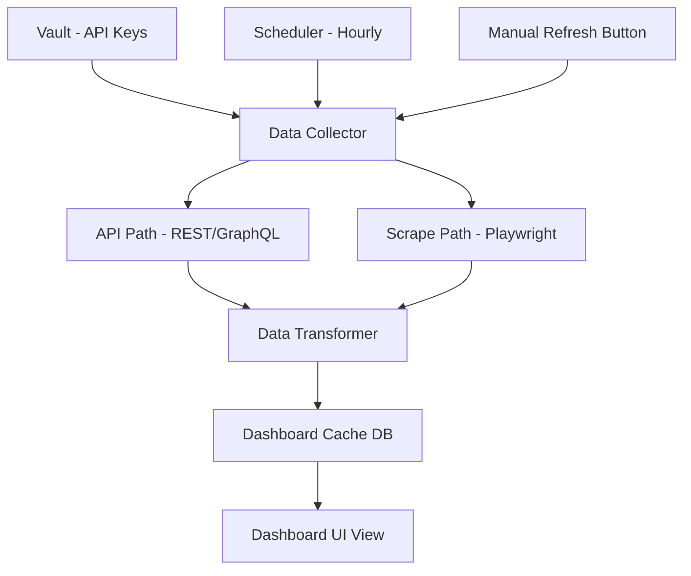
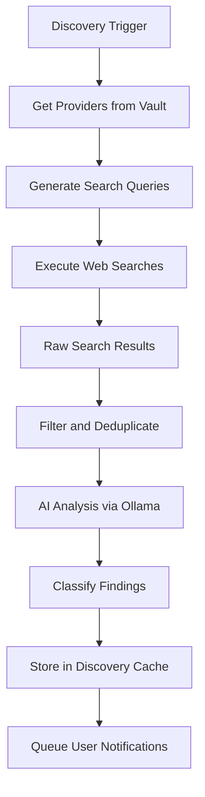
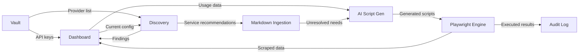

# Aggregate API Dashboard and Discovery Engine Specification

This document specifies the aggregate API dashboard that consolidates usage statistics from all vault API keys, and the intelligent API discovery engine that tracks capability changes and service updates.

**Status:** Post-MVP extension. Part of the automation subsystem.

Related:

- Automation architecture: [`plans/automation-subsystem-architecture.md`](plans/automation-subsystem-architecture.md:1)
- Playwright engine: [`plans/playwright-automation-engine.md`](plans/playwright-automation-engine.md:1)
- AI script generation: [`plans/ai-script-generation.md`](plans/ai-script-generation.md:1)
- Provider plugins: [`plans/provider-plugins-and-github.md`](plans/provider-plugins-and-github.md:1)
- Data model extensions: [`plans/data-model-automation-extensions.md`](plans/data-model-automation-extensions.md:1)

## Part A: Aggregate API Dashboard

### A.1) Purpose

Provide a single-pane view of all API keys in the vault with:

- **Usage statistics**: request counts, quota consumption, billing amounts
- **Configuration attributes**: API version, region, tier, enabled features
- **Restriction settings**: rate limits, IP restrictions, scope/permission boundaries
- **Health status**: key validity, expiration dates, service status

### A.2) Data collection architecture



### A.3) Data collection strategies per provider

Each provider plugin extends its definition with dashboard data sources:

```python
class ProviderDashboardConfig:
    # API-based data sources - preferred
    api_sources: list[APIDataSource]
    
    # Scraping-based data sources - fallback
    scrape_sources: list[ScrapeDataSource]
    
    # Refresh interval override - default is hourly
    refresh_interval_seconds: int = 3600
    
    # Whether this provider supports dashboard data
    dashboard_supported: bool = True

@dataclass
class APIDataSource:
    data_type: str          # usage_stats, config, restrictions
    endpoint: str           # API URL template
    method: str             # GET, POST
    auth_type: str          # bearer, api_key_header, api_key_query
    response_parser: str    # parser function name
    rate_limit_group: str   # for shared rate limiting

@dataclass
class ScrapeDataSource:
    data_type: str
    dashboard_url: str
    selectors: dict[str, str]  # field_name -> CSS selector
    requires_login: bool
    login_url: str | None
```

### A.4) Dashboard data model

Collected data is normalized into a common schema:

```python
@dataclass
class DashboardSnapshot:
    snapshot_id: str            # UUID
    provider_id: str
    secret_id: str              # FK to vault secret
    collected_at: str           # UTC ISO 8601
    collection_method: str      # api, scrape, cached
    staleness_seconds: int      # age of data
    
    usage_stats: UsageStats | None
    config_attributes: ConfigAttributes | None
    restrictions: Restrictions | None
    health: HealthStatus

@dataclass
class UsageStats:
    requests_today: int | None
    requests_this_month: int | None
    quota_used_percent: float | None
    cost_this_month: float | None
    cost_currency: str | None
    custom_metrics: dict[str, Any]  # provider-specific

@dataclass
class ConfigAttributes:
    api_version: str | None
    region: str | None
    tier: str | None
    enabled_features: list[str]
    custom_attributes: dict[str, str]

@dataclass
class Restrictions:
    rate_limit_per_minute: int | None
    rate_limit_per_day: int | None
    ip_restrictions: list[str]
    allowed_scopes: list[str]
    expiration_date: str | None
    custom_restrictions: dict[str, str]

@dataclass
class HealthStatus:
    key_valid: bool | None
    service_status: str         # operational, degraded, outage, unknown
    last_successful_call: str | None
    warnings: list[str]
```

### A.5) Dashboard UI

The dashboard is a new view within the PySide6 Qt UI:

#### Layout

```
+--------------------------------------------------+
| API Dashboard                    [Refresh All] ↻  |
+--------------------------------------------------+
| Filter: [All Providers ▼] [All Projects ▼]       |
+--------------------------------------------------+
| ┌──────────────────────────────────────────────┐  |
| │ Summary Cards                                │  |
| │ [12 Active Keys] [3 Expiring] [1 Warning]   │  |
| └──────────────────────────────────────────────┘  |
|                                                    |
| ┌─────────────┬────────────────────────────────┐  |
| │ Key List    │ Detail Panel                   │  |
| │             │                                │  |
| │ ▸ GitHub    │ Usage: 1,234 / 5,000 requests  │  |
| │   TOKEN_1   │ Cost: $0.00 this month         │  |
| │             │ Rate Limit: 5,000/hr           │  |
| │ ▸ OpenAI   │ Scopes: repo, read:org         │  |
| │   API_KEY   │ Expires: 2026-06-15            │  |
| │             │ Status: ● Valid                 │  |
| │ ▸ Stripe   │                                │  |
| │   SECRET    │ Last refreshed: 2 min ago      │  |
| │             │ [Refresh] [View Details]        │  |
| └─────────────┴────────────────────────────────┘  |
|                                                    |
| ┌──────────────────────────────────────────────┐  |
| │ Discovery Alerts (3 new)              [View] │  |
| └──────────────────────────────────────────────┘  |
+--------------------------------------------------+
```

#### Features

- **Summary cards**: aggregate counts and warnings at a glance
- **Filterable key list**: filter by provider, project, status
- **Detail panel**: full usage/config/restriction data for selected key
- **Staleness indicators**: show data age with color coding
  - Green: < 1 hour old
  - Yellow: 1-24 hours old
  - Red: > 24 hours old or collection failed
- **Manual refresh**: per-key and bulk refresh buttons
- **Discovery alerts**: badge showing new findings from the discovery engine

### A.6) Background refresh

- **Hourly refresh**: scheduler triggers data collection for all active keys
- **Staggered execution**: spread requests across the hour to avoid bursts
- **Priority ordering**: keys with warnings or approaching limits refresh first
- **Failure handling**: failed refreshes show cached data with staleness warning
- **Quiet hours**: configurable time window when no background refresh occurs (default: none)

### A.7) Caching

- Dashboard data cached in SQLite table `dashboard_snapshots` (see data model extensions)
- Keep last 24 snapshots per key (one per hour for a day)
- Older snapshots aggregated to daily summaries
- Cache invalidated on manual refresh

---

## Part B: API Discovery Engine

### B.1) Purpose

Perform intelligent web searches to track:

- **Capability changes**: new API features, deprecated endpoints
- **Pricing updates**: plan changes, new tiers, price increases/decreases
- **Service modifications**: terms of service changes, region availability
- **New alternatives**: competing services for capabilities the user needs
- **Security advisories**: known vulnerabilities or breaches affecting API providers

### B.2) Discovery schedule

| Trigger | Frequency | Scope |
|---|---|---|
| Scheduled | Daily at configurable time | All providers in vault |
| On-demand | User-initiated | Selected provider or all |
| Application launch | Once per launch | All providers, catch-up for missed days |

### B.3) Network permission

The discovery engine has its own network toggle:

- `discovery_network_enabled` in `profile_settings`
- Independent of the existing Online Mode toggle
- When disabled: no searches performed, cached results still viewable
- When enabled: outbound HTTPS to search engines and documentation sites only

Domain allowlist for discovery:

- Search engines: configurable list (default: DuckDuckGo API)
- Provider documentation domains: derived from provider plugin `docs_url`
- API changelog/status pages: derived from provider plugin metadata

### B.4) Search strategy



### B.5) Query generation

For each provider, generate targeted search queries:

```python
QUERY_TEMPLATES = [
    "{provider_name} API changelog {current_year}",
    "{provider_name} API pricing update",
    "{provider_name} API deprecation notice",
    "{provider_name} API new features",
    "{provider_name} service status incident",
    "{provider_name} API security advisory",
]
```

Query generation is enhanced by AI:

- Ollama analyzes the user's current API configuration
- Generates provider-specific queries based on the features the user actually uses
- Avoids redundant queries for features the user does not use

### B.6) Search execution

- **Primary search method**: DuckDuckGo Instant Answer API (no API key required)
- **Fallback**: DuckDuckGo HTML search with Playwright scraping
- **Rate limiting**: maximum 10 searches per provider per day
- **Result limit**: top 10 results per query
- **Deduplication**: by URL across queries for the same provider

### B.7) AI analysis of results

Each search result is analyzed by Ollama:

1. **Relevance scoring**: is this result relevant to the user's API usage?
2. **Category classification**: capability change, pricing, deprecation, security, etc.
3. **Impact assessment**: how does this affect the user's current setup?
4. **Action recommendation**: what should the user do?
5. **Urgency rating**: informational, advisory, action-needed, critical

Analysis prompt includes:

- Provider name and current configuration (no secrets)
- Search result title, snippet, and URL
- User's current API tier/plan if known from dashboard data

### B.8) Discovery findings model

```python
@dataclass
class DiscoveryFinding:
    finding_id: str                # UUID
    provider_id: str
    discovered_at: str             # UTC ISO 8601
    source_url: str
    source_title: str
    source_snippet: str
    
    category: str                  # capability_change, pricing_update, deprecation,
                                   # security_advisory, new_alternative, service_modification
    
    impact_summary: str            # AI-generated summary
    action_recommendation: str     # AI-generated recommendation
    urgency: str                   # informational, advisory, action_needed, critical
    relevance_score: float         # 0.0-1.0
    
    user_status: str               # new, reviewed, dismissed, actioned
    reviewed_at: str | None
    user_notes: str | None
```

### B.9) Discovery UI

Integrated into the dashboard view:

#### Alert list

```
+--------------------------------------------------+
| Discovery Alerts                                   |
+--------------------------------------------------+
| Filter: [All ▼] [Unreviewed ▼] [All Urgency ▼]  |
+--------------------------------------------------+
| 🔴 CRITICAL - OpenAI API pricing increase         |
|    Effective 2026-03-01. GPT-4 input tokens +15%  |
|    Action: Review budget allocation                |
|    [Review] [Dismiss]                              |
+--------------------------------------------------+
| 🟡 ADVISORY - GitHub fine-grained PAT changes     |
|    New permission model for repository access      |
|    Action: Review token scopes                     |
|    [Review] [Dismiss]                              |
+--------------------------------------------------+
| 🔵 INFO - Stripe adds new webhook event types     |
|    5 new event types for payment intents           |
|    [Review] [Dismiss]                              |
+--------------------------------------------------+
```

#### Detail view

When a finding is selected:

- Full AI-generated impact analysis
- Link to source URL
- Current configuration context from dashboard
- Suggested actions with automation script generation option
- User notes field
- Status tracking: new → reviewed → actioned/dismissed

### B.10) Discovery data retention

- Keep findings for 90 days by default (configurable)
- Dismissed findings can be permanently deleted
- Actioned findings are archived with resolution notes
- Search result cache: 7 days

---

## Part C: Shared infrastructure

### C.1) Scheduler implementation

Use `APScheduler` with the following job configuration:

```python
# Dashboard refresh - hourly
scheduler.add_job(
    dashboard_refresh_all,
    trigger="interval",
    hours=1,
    jitter=300,  # 5-minute random jitter to avoid thundering herd
    id="dashboard_hourly_refresh"
)

# Discovery engine - daily
scheduler.add_job(
    discovery_search_all,
    trigger="cron",
    hour=configurable_hour,  # default: 3 AM local time
    id="discovery_daily_search"
)

# Discovery catch-up - on launch
scheduler.add_job(
    discovery_catchup,
    trigger="date",
    run_date=now,
    id="discovery_launch_catchup"
)
```

### C.2) Notification system

Background processes notify the user through:

1. **Qt system tray notifications**: for critical/action-needed findings
2. **In-app toast notifications**: for completed background tasks
3. **Badge counts**: on dashboard tab and discovery section
4. **Status bar**: shows current background task status

Notification preferences are configurable per category:

- Dashboard refresh complete: toast only (default)
- Discovery finding - critical: system tray + toast + badge
- Discovery finding - advisory: badge only (default)
- Discovery finding - informational: badge only (default)
- Automation error: system tray + toast

### C.3) Data flow between components



## Acceptance criteria

### Dashboard

- Displays consolidated data for all vault API keys
- Supports both API-based and scraping-based data collection
- Hourly background refresh with manual override
- Staleness indicators show data freshness
- Cached data available when collection fails
- No secrets displayed in dashboard (masked by default)

### Discovery engine

- Performs daily searches for all vault providers
- AI analyzes and classifies findings
- Urgency-based notification system
- Independent network permission from Online Mode
- Findings are reviewable and actionable
- Rate limiting prevents search engine blocking

### Shared

- Scheduler runs reliably within Qt event loop
- Notifications are configurable per category
- All background actions logged to audit trail
- Data retention policies are enforced
