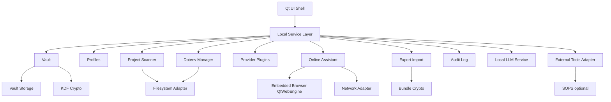

# KeyClave core architecture and module boundaries

This document defines the internal module boundaries for KeyClave so Code mode can implement the app incrementally with clear interfaces.

Related:

- Product scope: [`plans/product-scope.md`](plans/product-scope.md)
- Reuse policy: [`plans/reuse-strategy.md`](plans/reuse-strategy.md)
- UI stack ADR: [`plans/adr-0001-ui-stack-pyside6-qtwebengine.md`](plans/adr-0001-ui-stack-pyside6-qtwebengine.md)

## High-level shape

KeyClave is a single desktop application process with a clear separation between:

- Qt UI layer
- Local Service Layer (application core)
- Adapters (filesystem, network, OS credential store, external tools)

### Module map

## Proposed package layout

Implementation can vary, but the intention is to keep interfaces stable and minimize cross-module imports.

- `keyclave/ui/` (Qt UI, view models)
- `keyclave/app/` (Local Service Layer orchestration)
- `keyclave/vault/` (encryption, storage, key lifecycle)
- `keyclave/profiles/` (profile creation, switching, lock state)
- `keyclave/projects/` (scan roots, file discovery, Markdown ingestion)
- `keyclave/env/` (dotenv parse, diff, merge, write)
- `keyclave/providers/` (plugin system + built-in providers like GitHub)
- `keyclave/online/` (offline playbooks + online human-in-loop browsing)
- `keyclave/export/` (bundle format + import/export)
- `keyclave/audit/` (redacted event log)
- `keyclave/adapters/` (filesystem, network, keychain, external tools)
- `keyclave/common/` (types, error taxonomy, utilities)
- `keyclave/llm/` (local LLM service, model management, policy wrapper)

## UI Shell

### Responsibilities
- Navigation, theming, accessibility.
- Audio feedback via `SoundManager` (see [`plans/ux-brand-sonic.md`](plans/ux-brand-sonic.md:253)).
- Display secret values only under explicit user action and for a short period.
- Gather user approvals for sensitive operations:
  - unlock
  - export
  - write to project files
  - Online Mode enable
  - full-disk scan permissions

### Interface with Local Service Layer
UI calls a narrow set of service methods and subscribes to state changes.

Core patterns:
- Command methods return structured results and typed errors.
- Long-running tasks expose progress events.

## Local Service Layer

### Responsibilities
- Own the application state machine.
- Enforce Mode boundaries (Offline vs Online).
- Enforce profile selection and lock state.
- Centralize redaction rules for logs and errors.

### State machines

#### Profile lock state
- Locked: vault key material not in memory.
- Unlocked: vault key material available only in memory.
- Timed lock: auto-lock after inactivity.

#### Online Mode state
- Disabled (default)
- Enabled

Online Mode is about embedded browsing and provider validation. LLM assistance (if enabled) must remain local-only per [`plans/local-llm-inference.md`](plans/local-llm-inference.md:1).

Mode state must be clearly visible in UI and applied to all network-related adapters.

## Profiles

### Responsibilities
- Create and manage multiple local profiles.
- Switch profiles (sign in/out) within the app.
- Maintain per-profile settings:
  - vault storage option (passphrase-only default vs OS credential store)
  - optional TOTP
  - Online Mode preferences

### Data boundaries
- Profiles must never share decrypted secrets.
- UI must not list secrets from a locked profile.

## Vault

### Responsibilities
- Encrypt at rest.
- Provide CRUD operations for keys and secret metadata.
- Manage key derivation and unlock.

### Storage options
- Default: passphrase-only (derive vault key using memory-hard KDF).
- Optional: OS credential store backed (store wrapped vault key; still allow passphrase gate if configured).

### API surface (conceptual)

- `vault.unlock(profile_id, passphrase, totp_code_optional)`
- `vault.lock(profile_id)`
- `vault.put_secret(provider_id, name, value, metadata)`
- `vault.get_secret(secret_id)`
- `vault.list_secrets(filters)`
- `vault.delete_secret(secret_id)`

All `get` calls must support masked responses by default, with explicit reveal.

## Project Scanner

### Responsibilities
- Discover project roots.
- Enumerate Markdown design docs.
- Extract required providers and environment variables.
- Maintain citations for why a provider was inferred.

### Safety controls
- Full-disk scanning is opt-in with explicit prompts.
- Support excludes:
  - `node_modules`
  - `.git`
  - `dist`
  - `build`
  - large binary files

### Output shape
- `ProjectScanResult`
  - `project_root`
  - `docs_used`
  - `requirements`
    - provider candidate
    - env var names
    - confidence
    - citations

## Markdown ingestion

### Responsibilities
- Parse Markdown.
- Identify:
  - provider names
  - API references
  - env var keys like `GITHUB_TOKEN`
  - links to provider docs

### Notes
- MVP can be rule-based with a lightweight extractor.
- Later can add optional **local** LLM assistance (no cloud), governed by local model availability and user settings.

## Dotenv Manager

### Responsibilities
- Read, parse, and write dotenv files.
- Compute diffs and safe merges.
- Create backups and restore.

### Merge policy (MVP)
- Never delete unknown keys.
- Only update keys the user selected.
- Preserve ordering and comments where feasible.
- Write atomically:
  - write temp
  - fsync
  - rename

## Provider Plugins

### Responsibilities
 - Provide provider definitions:
   - provider id
   - expected env vars
   - onboarding playbook
   - validator
   - restriction probes

### Contract
- `discover_requirements(text, context) -> list[Requirement]`
- `validate_key(key) -> ValidationResult`
- `probe_restrictions(key) -> RestrictionInfo` (best-effort)
- `onboarding_steps(mode) -> list[Step]`

### GitHub
GitHub is the first built-in provider and sets the standard for:

 - env var naming conventions
 - validation test call policy
 - onboarding playbook

## Online Assistant

### Responsibilities
- Provide provider onboarding playbooks.
- Support embedded browsing (QtWebEngine) with human confirmation gates.
- Support Offline Mode read-only checklists.

### Human-in-the-loop guardrails
- No auto form submission of credentials.
- No automatic clipboard reading unless user explicitly triggers import.
- Clear step-by-step UI:
  - proposed action
  - reason
  - user confirmation
  - result capture (user confirms completion)

### Local LLM assistance (optional)
- If enabled, the assistant may use a local model to suggest the next step.
- It must not make network calls.
- The assistant must remain usable with deterministic playbooks only.

## Export Import

### Responsibilities
- Encrypted export bundles of selected keys.
- Import bundles into a selected profile.
- Optional public-key mode for recipients.

### Bundle requirements
- Integrity protection.
- Explicit metadata:
  - provider ids
  - env var names
  - created time
  - optional expiry
- No plaintext secrets on disk.

## Audit Log

### Responsibilities
- Record security-relevant events locally:
  - unlock attempts
  - exports
  - file writes
  - Online Mode enable
- Redact secrets.

## Adapters

### Filesystem Adapter
- Centralize path handling.
- Provide atomic writes and safe backup utilities.
- Enforce scan exclusions.

### Network Adapter
- Enforce Online Mode state.
- Provide domain allowlists for validators.
- Rate limiting and safe retries.

### OS credential store adapter
- Abstract Keychain on macOS, Credential Manager on Windows, Secret Service on Linux.

### External tools adapter
- Optional integration with SOPS.
- Provide detection, invocation, and output parsing.
- Never required in core flows.

## Next steps
1) Confirm this module map is acceptable for MVP.
2) Draft the security and crypto spec (vault KDF, at-rest encryption, export bundle crypto, Online Mode boundaries).
