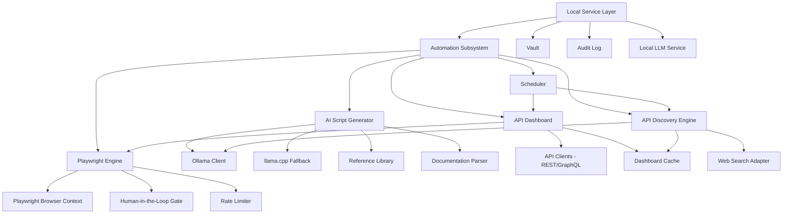

# Automation Subsystem Architecture (Post-MVP Extension)

This document defines the architecture for KeyClave's automation subsystem — a post-MVP extension that adds browser automation, AI-powered script generation, an aggregate API dashboard, and an intelligent API discovery engine.

**Status:** Post-MVP extension. Depends on completion of Milestones 0–7 from [`plans/implementation-backlog.md`](plans/implementation-backlog.md:1).

Related:

- Product scope: [`plans/product-scope.md`](plans/product-scope.md:1)
- Architecture boundaries: [`plans/architecture-module-boundaries.md`](plans/architecture-module-boundaries.md:1)
- Online assistant UX: [`plans/online-assistant-ux.md`](plans/online-assistant-ux.md:1)
- Local LLM inference: [`plans/local-llm-inference.md`](plans/local-llm-inference.md:1)
- Security boundaries: [`plans/security-crypto-2fa.md`](plans/security-crypto-2fa.md:1)
- Telemetry/logging: [`plans/telemetry-logging.md`](plans/telemetry-logging.md:1)
- Playwright automation engine: [`plans/playwright-automation-engine.md`](plans/playwright-automation-engine.md:1)
- AI script generation: [`plans/ai-script-generation.md`](plans/ai-script-generation.md:1)
- API dashboard and discovery: [`plans/api-dashboard-and-discovery.md`](plans/api-dashboard-and-discovery.md:1)
- Data model extensions: [`plans/data-model-automation-extensions.md`](plans/data-model-automation-extensions.md:1)

## 1) Overview

The automation subsystem introduces four interconnected capabilities:

1. **Aggregate API Dashboard** — consolidates usage statistics, configuration, and restrictions from all API keys in the vault
2. **Playwright Automation Engine** — browser automation using Playwright for Python to interact with service dashboards
3. **AI Script Generation System** — uses local Ollama models to autonomously create Playwright scripts from documentation
4. **API Discovery Engine** — scheduled web searches to track capability changes, pricing updates, and new features

### Design principles

- **Playwright over Puppeteer**: use Playwright for Python to stay within the existing Python ecosystem and avoid a Node.js subprocess dependency
- **Hybrid API+scraping**: prefer official REST/GraphQL APIs where available; fall back to Playwright-based scraping only when no API exists
- **Human-in-the-loop for critical actions**: mandatory approval gates before financial transactions, account modifications, and irreversible changes
- **Autonomous for read-only operations**: dashboard data collection, documentation research, and status checks run without user intervention
- **Ollama as primary LLM backend**: with llama.cpp bundled runtime as fallback per [`plans/local-llm-inference.md`](plans/local-llm-inference.md:34)
- **Independent network permission for discovery**: the API discovery engine has its own network toggle, separate from the existing Online Mode

## 2) Module map extension

### New packages

- `keyclave/automation/` — orchestration layer for the automation subsystem
- `keyclave/automation/playwright_engine/` — Playwright browser management, page actions, scraping
- `keyclave/automation/dashboard/` — aggregate API dashboard data collection and caching
- `keyclave/automation/ai_scripts/` — AI-powered script generation and management
- `keyclave/automation/discovery/` — API discovery engine with web search
- `keyclave/automation/scheduler/` — background task scheduling for hourly/daily updates
- `keyclave/automation/hitl/` — human-in-the-loop checkpoint system
- `keyclave/automation/reference_library/` — local Puppeteer/Playwright reference materials

## 3) Operational modes

### 3.1 Autonomous Mode

A new mode alongside Offline and Online:

- **Autonomous Mode** is disabled by default and requires explicit user enable per profile
- When enabled, the automation subsystem can perform read-only operations without per-action confirmation
- Read-only operations include: dashboard data collection, documentation research, API discovery searches
- All autonomous actions are logged to the audit trail

### 3.2 Human-in-the-loop checkpoints

Mandatory approval gates at these decision points:

| Action category | Checkpoint required | Approval UI |
|---|---|---|
| Financial transactions | Always | Modal dialog with amount, description, confirm/cancel |
| Account creation | Always | Step-by-step wizard with preview |
| Payment method changes | Always | Modal with details, requires TOTP if enabled |
| Billing restriction changes | Always | Preview of before/after, confirm/cancel |
| API key creation/deletion | Always | Preview with scope details |
| Irreversible account changes | Always | Warning dialog with undo information |
| Script execution - first run | Always | Full script review panel |
| Script execution - repeat run | Configurable | Can be set to auto-approve for trusted scripts |
| Dashboard data refresh | Never - autonomous | Background notification only |
| Documentation research | Never - autonomous | Background notification only |
| API discovery search | Never - autonomous | Results queued for review |

### 3.3 Discovery engine network permission

The API discovery engine has its own network toggle independent of Online Mode:

- `discovery_network_enabled` in `profile_settings`
- Can be enabled even when Online Mode is disabled for browsing
- Only permits outbound HTTPS to search engines and API documentation sites
- Domain allowlist is configurable per profile

## 4) Security boundaries

### 4.1 Credential handling in automation

- Playwright browser contexts use isolated profiles per provider
- Credentials are retrieved from the vault only when needed and never persisted in browser storage
- Session cookies are ephemeral by default
- No credentials are passed to the LLM — only documentation text and non-secret metadata
- Playwright scripts generated by AI are sandboxed and reviewed before first execution

### 4.2 Rate limiting

Per-provider rate limits apply to all automation actions:

- Dashboard scraping: configurable interval per provider, minimum 5 minutes between refreshes
- API calls: respect provider rate limit headers, implement exponential backoff
- Discovery searches: maximum 1 search per provider per day
- Script execution: one concurrent execution per provider

### 4.3 Error recovery

- All Playwright actions wrapped in retry logic with configurable max attempts
- Screenshot capture on failure for debugging, stored locally and auto-deleted after configurable retention
- Graceful degradation: if scraping fails, fall back to cached data with staleness indicator
- Circuit breaker pattern: after N consecutive failures for a provider, pause automation and notify user

### 4.4 Audit trail

All automation actions are logged to `audit_events` with event types:

- `automation.dashboard.refresh`
- `automation.script.generated`
- `automation.script.executed`
- `automation.script.approved`
- `automation.script.rejected`
- `automation.discovery.search`
- `automation.discovery.alert`
- `automation.hitl.approved`
- `automation.hitl.rejected`
- `automation.error`

Redaction rules from [`plans/telemetry-logging.md`](plans/telemetry-logging.md:98) apply to all automation logs.

## 5) Background processing

### 5.1 Scheduler

The automation subsystem uses a lightweight in-process scheduler:

- **Hourly**: dashboard data refresh for all active API keys
- **Daily**: API discovery engine searches
- **On application launch**: discovery engine catch-up scan
- **On demand**: manual refresh via UI button

Implementation: use `APScheduler` or a simple `asyncio` task loop within the Qt event loop.

### 5.2 User notifications

Background processes must notify the user:

- **Toast notifications** in the Qt UI for completed background tasks
- **Badge indicators** on the dashboard tab for new data
- **Alert queue** for discovery findings that need review
- **Progress indicators** for long-running operations like bulk dashboard refresh

## 6) Reference library

### 6.1 Content to download

Download and maintain locally:

- Playwright Python documentation and examples from GitHub
- Puppeteer documentation and examples from GitHub as reference for AI learning
- Common browser automation patterns and best practices
- Provider-specific automation examples where available

### 6.2 Storage

- Location: `<root_data_dir>/reference_library/`
- Structure:
  - `playwright/` — Playwright docs and examples
  - `puppeteer/` — Puppeteer docs and examples as AI reference
  - `patterns/` — common automation patterns
  - `provider_docs/` — cached provider documentation

### 6.3 Update policy

- Reference library downloads are user-initiated
- Checksum verification for downloaded content
- Version tracking in a local manifest

## 7) Integration with existing systems

### 7.1 Vault integration

- Dashboard reads API keys from the vault to authenticate with provider dashboards/APIs
- Keys are decrypted in memory only for the duration of the API call or browser session
- No keys are stored in Playwright browser profiles or automation scripts

### 7.2 Provider plugin integration

- Each provider plugin can optionally expose:
  - `dashboard_url` — URL for the provider's usage dashboard
  - `api_endpoints` — REST/GraphQL endpoints for programmatic data access
  - `scraping_selectors` — CSS/XPath selectors for dashboard scraping fallback
  - `automation_playbooks` — step definitions for common automation tasks

### 7.3 Markdown ingestion integration

- The existing markdown ingestion pipeline from [`plans/markdown-ingestion.md`](plans/markdown-ingestion.md:1) feeds into the AI script generation system
- When markdown analysis identifies API needs without specified services, the system generates service recommendations using the discovery engine

### 7.4 LLM service integration

- Ollama is the primary backend for all automation LLM tasks
- Falls back to bundled llama.cpp if Ollama is not available
- Policy wrapper from [`plans/local-llm-inference.md`](plans/local-llm-inference.md:159) applies to all automation prompts
- No secrets in prompts — only documentation text, non-secret metadata, and task descriptions

## 8) Acceptance criteria

- Automation subsystem is fully optional and does not affect core vault/import/export workflows
- Human-in-the-loop gates cannot be bypassed for financial/irreversible actions
- All automation actions are logged to the audit trail
- Rate limiting prevents service disruptions
- Error recovery handles common failure modes gracefully
- Background processes provide clear user notifications
- No secrets are exposed in automation scripts, logs, or LLM prompts
- Discovery engine network permission is independent of Online Mode
- Reference library is downloadable and version-tracked
