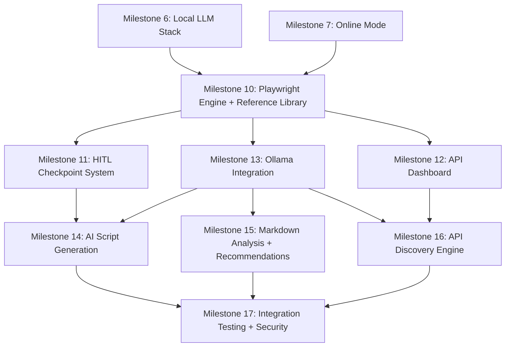

# Implementation Backlog: Automation Subsystem (Post-MVP Milestones)

This backlog extends [`plans/implementation-backlog.md`](plans/implementation-backlog.md:1) with milestones for the automation subsystem. These milestones are numbered 10+ to follow the existing MVP milestones (0–9).

**Prerequisite:** Milestones 0–7 from the MVP backlog must be substantially complete before starting these milestones. Milestone 6 (Local LLM stack) is a hard dependency.

Inputs:

- Automation architecture: [`plans/automation-subsystem-architecture.md`](plans/automation-subsystem-architecture.md:1)
- Playwright engine: [`plans/playwright-automation-engine.md`](plans/playwright-automation-engine.md:1)
- AI script generation: [`plans/ai-script-generation.md`](plans/ai-script-generation.md:1)
- API dashboard and discovery: [`plans/api-dashboard-and-discovery.md`](plans/api-dashboard-and-discovery.md:1)
- Data model extensions: [`plans/data-model-automation-extensions.md`](plans/data-model-automation-extensions.md:1)

---

## Milestone 10: Playwright engine foundation + reference library

### Tasks

- Add `playwright` Python package to project dependencies
- Implement browser context manager:
  - Per-provider isolated contexts
  - Ephemeral and persistent context modes
  - Browser launch configuration (headless/headed, viewport, feature restrictions)
- Implement page action library:
  - Core actions: `navigate_to`, `click_element`, `fill_field`, `extract_text`, `extract_table`
  - Network interception: `intercept_api_response`
  - Debug: `screenshot`
- Implement rate limiter for Playwright actions:
  - Per-provider configurable limits
  - Global concurrent context limit
  - Exponential backoff
- Download reference library content:
  - Clone/download Playwright Python docs and examples from `microsoft/playwright-python`
  - Clone/download Puppeteer docs and examples from `puppeteer/puppeteer`
  - Download community patterns from `mxschmitt/awesome-playwright`
  - Create `reference_library/manifest.db` with version tracking
- Implement reference library search index for AI context injection
- Run database migration: add automation columns to `profile_settings` and `providers`

### Acceptance

- Playwright can launch a browser, navigate to a URL, and extract page content
- Browser contexts are isolated per provider
- Rate limiting prevents burst requests
- Reference library is downloaded, indexed, and searchable
- Migration runs without affecting existing data

---

## Milestone 11: Human-in-the-loop checkpoint system

### Tasks

- Implement HITL checkpoint framework:
  - Checkpoint types: `financial`, `account`, `irreversible`, `api_key`, `billing`, `script_review`
  - Checkpoint pause/resume mechanism for async script execution
  - Decision recording to `hitl_checkpoints` table
- Implement HITL UI components:
  - Modal dialog for checkpoint approval with context display
  - Proposed action description and consequences
  - Approve/reject/modify controls
  - TOTP verification integration for financial checkpoints (if TOTP enabled)
- Implement script execution sandbox:
  - Timeout enforcement
  - Network scope restriction (provider domain allowlist)
  - File system access restriction
  - Resource limits (max pages, max navigations)
- Run database migration: create `hitl_checkpoints` table

### Acceptance

- Checkpoints pause script execution and display approval UI
- Financial/irreversible checkpoints cannot be bypassed
- All checkpoint decisions are logged to audit trail
- Sandbox constraints are enforced (timeout, network, filesystem)
- TOTP verification works at financial checkpoints when enabled

---

## Milestone 12: Aggregate API dashboard

### Tasks

- Implement dashboard data collector:
  - API-based collection path (REST/GraphQL with API key auth)
  - Playwright scraping fallback path
  - Data transformation to normalized `DashboardSnapshot` model
- Implement provider dashboard configurations:
  - Extend GitHub provider with dashboard data sources
  - Define `ProviderDashboardConfig` contract for future providers
  - Implement selector management with `provider_selectors` table
- Implement dashboard cache:
  - `dashboard_snapshots` table with 24-row-per-secret retention
  - `dashboard_daily_summaries` aggregation job
  - Staleness tracking and indicators
- Implement dashboard UI view in Qt:
  - Summary cards (active keys, expiring, warnings)
  - Filterable key list by provider/project
  - Detail panel with usage/config/restrictions
  - Staleness color coding (green/yellow/red)
  - Manual refresh per-key and bulk
- Implement background scheduler:
  - Hourly dashboard refresh with jitter
  - Staggered execution across providers
  - Quiet hours support
  - Priority ordering (warnings first)
- Implement notification system:
  - Toast notifications for completed refreshes
  - Badge indicators on dashboard tab
  - Status bar for current background task
- Run database migration: create `dashboard_snapshots`, `dashboard_daily_summaries`, `provider_selectors` tables

### Acceptance

- Dashboard displays consolidated data for all vault API keys
- Both API and scraping collection paths work
- Hourly background refresh runs reliably
- Staleness indicators accurately reflect data age
- Cached data shown when collection fails
- Notifications inform user of background activity
- No secrets displayed in dashboard (masked by default)

---

## Milestone 13: Ollama integration for automation

### Tasks

- Implement Ollama client for automation tasks:
  - Health check: `GET /api/tags`
  - Model management: `POST /api/pull`, model listing
  - Generation: `POST /api/generate` for single-turn tasks
  - Chat: `POST /api/chat` for multi-turn script generation
- Implement model selection logic:
  - Prefer `qwen2.5-coder:7b` for code generation
  - Prefer `qwen2.5:7b` for documentation analysis
  - Fall back to bundled llama.cpp if Ollama unavailable
- Implement prompt template system:
  - Jinja2 templates for each task type
  - Strict variable escaping
  - No-secrets policy enforcement in prompt construction
- Implement prompt safety validator:
  - Scan prompts for secret patterns before sending to LLM
  - Reject prompts containing vault data
  - Log prompt metadata (not content) to audit trail
- Extend existing `LLMService` interface with automation-specific methods:
  - `generate_script(task, provider, context)`
  - `analyze_documentation(text, provider)`
  - `recommend_services(requirements)`
  - `repair_selectors(broken_selector, page_html_excerpt)`

### Acceptance

- Ollama client communicates with local Ollama instance
- Model selection works correctly per task type
- Fallback to llama.cpp works when Ollama is unavailable
- No secrets appear in any prompts
- Prompt safety validator catches secret patterns
- All LLM interactions logged (metadata only) to audit trail

---

## Milestone 14: AI script generation pipeline

### Tasks

- Implement research phase:
  - Reference library search for relevant examples
  - Provider documentation fetching and parsing
  - Procedure extraction from documentation
  - Form field identification
  - `ResearchResult` data model
- Implement planning phase:
  - Step-to-Playwright-action mapping
  - HITL checkpoint identification and injection
  - Error handling strategy planning
  - `ScriptPlan` data model
- Implement generation phase:
  - Script skeleton generation (imports, setup, teardown)
  - Step implementation with Playwright actions
  - HITL checkpoint injection
  - Error handling and logging code generation
  - Standard script template enforcement
- Implement validation phase:
  - Python AST syntax checking
  - Security scan (no hardcoded secrets, no unauthorized network access)
  - HITL checkpoint completeness verification
  - Optional dry-run against mock browser context
- Implement script management UI:
  - Script review panel with syntax highlighting
  - Approve/reject/edit controls
  - Execution history view
  - Script versioning display
- Run database migration: create `automation_scripts`, `automation_executions` tables

### Acceptance

- AI generates syntactically valid Playwright scripts
- Generated scripts include all required HITL checkpoints
- Security scan catches hardcoded secrets and unauthorized access
- Scripts use placeholder tokens for credentials
- Users can review, edit, approve, or reject scripts
- Script execution is tracked with full audit trail

---

## Milestone 15: Markdown analysis and service recommendations

### Tasks

- Extend markdown ingestion pipeline with AI augmentation:
  - Identify unresolved requirements (functional descriptions without named services)
  - Classify capability needs (e.g., "image processing", "payment processing")
- Implement service recommendation engine:
  - AI-powered matching of capabilities to known providers
  - Integration with discovery engine for pricing/feature data
  - Ranked recommendation output with rationale
  - `ServiceRecommendation` data model
- Implement recommendation UI:
  - Recommendation cards with match score, rationale, pricing
  - Accept/reject controls per recommendation
  - "Research more" action that triggers discovery engine
- Run database migration: create `service_recommendations` table

### Acceptance

- Unresolved API needs are identified from markdown documents
- AI generates relevant service recommendations with rationale
- Recommendations include pricing information when available
- Users can accept, reject, or request more research
- Accepted recommendations create provider entries and requirement records

---

## Milestone 16: API discovery engine

### Tasks

- Implement web search adapter:
  - DuckDuckGo Instant Answer API integration (primary)
  - DuckDuckGo HTML search with Playwright scraping (fallback)
  - Rate limiting: max 10 searches per provider per day
  - Result deduplication by URL
- Implement query generation:
  - Template-based queries per provider
  - AI-enhanced queries based on user's current configuration
- Implement AI analysis of search results:
  - Relevance scoring
  - Category classification (capability change, pricing, deprecation, security, etc.)
  - Impact assessment
  - Action recommendation
  - Urgency rating
- Implement discovery scheduler:
  - Daily scheduled search at configurable hour
  - On-demand search per provider or all
  - Application launch catch-up scan
- Implement discovery network permission:
  - Independent toggle from Online Mode
  - Domain allowlist enforcement
- Implement discovery UI:
  - Alert list with urgency color coding
  - Detail view with AI analysis
  - Status tracking (new → reviewed → actioned/dismissed)
  - User notes field
- Implement notification integration:
  - System tray notifications for critical findings
  - Badge counts on dashboard
  - Configurable notification preferences per urgency level
- Run database migration: create `discovery_findings`, `discovery_search_log` tables

### Acceptance

- Discovery engine performs daily searches for all vault providers
- AI classifies and rates findings by urgency
- Independent network permission works correctly
- Notifications alert users to critical findings
- Findings are reviewable with status tracking
- Rate limiting prevents search engine blocking
- All searches logged to audit trail

---

## Milestone 17: Integration testing and security hardening

### Tasks

- End-to-end integration tests:
  - Dashboard collection → cache → UI display
  - Script generation → review → execution → HITL → completion
  - Discovery search → analysis → notification → user review
  - Markdown analysis → recommendation → acceptance
- Security tests:
  - Verify no secrets in Playwright scripts, prompts, or logs
  - Verify HITL checkpoints cannot be bypassed
  - Verify sandbox constraints (timeout, network, filesystem)
  - Verify credential isolation between provider contexts
  - Verify discovery engine respects domain allowlist
- Performance tests:
  - Dashboard refresh with 50+ API keys
  - Script generation latency with Ollama
  - Discovery engine with 20+ providers
  - Scheduler reliability under load
- Error recovery tests:
  - Network failure during dashboard refresh
  - Ollama unavailable during script generation
  - Browser crash during script execution
  - Search engine rate limiting during discovery
- Accessibility audit for new UI components:
  - Dashboard view keyboard navigation
  - HITL checkpoint dialogs screen reader compatibility
  - Discovery alert list accessibility

### Acceptance

- All integration test scenarios pass
- No secrets leak in any automation pathway
- HITL gates are verified as non-bypassable
- Performance is acceptable for typical vault sizes
- Error recovery handles all documented failure modes
- Accessibility audit passes for new UI components

---

## Dependency graph

## Summary

| Milestone | Title | Key dependencies |
|---|---|---|
| 10 | Playwright engine + reference library | MVP Milestones 6, 7 |
| 11 | HITL checkpoint system | Milestone 10 |
| 12 | Aggregate API dashboard | Milestone 10 |
| 13 | Ollama integration for automation | Milestone 10 |
| 14 | AI script generation pipeline | Milestones 11, 13 |
| 15 | Markdown analysis + service recommendations | Milestone 13 |
| 16 | API discovery engine | Milestones 12, 13 |
| 17 | Integration testing + security hardening | Milestones 14, 15, 16 |
