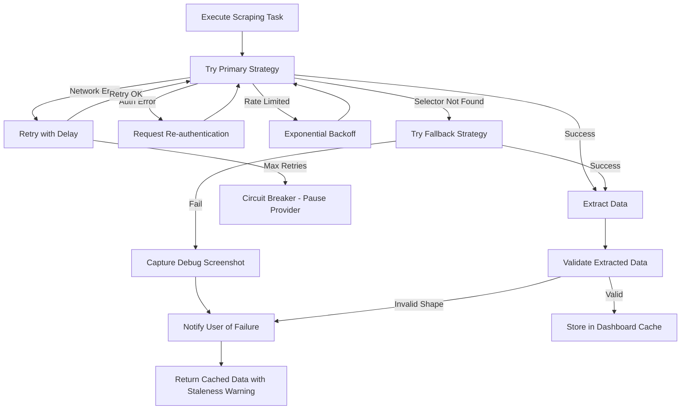
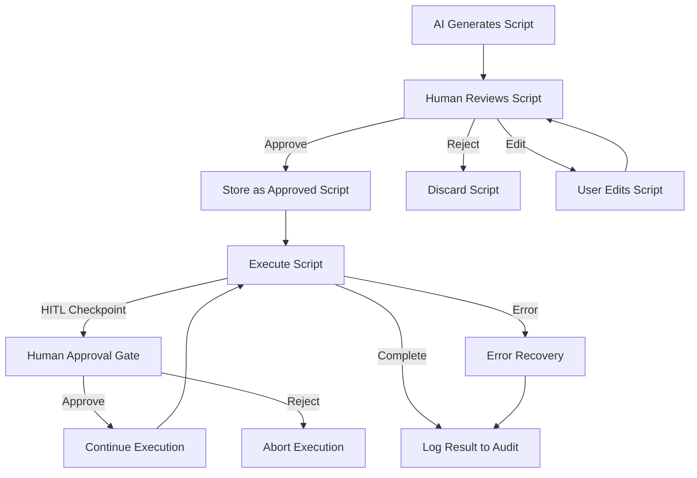

# Playwright Automation Engine Specification

This document specifies the browser automation engine that powers KeyClave's dashboard scraping, AI-generated script execution, and automated service interactions.

**Status:** Post-MVP extension. Part of the automation subsystem.

Related:

- Automation architecture: [`plans/automation-subsystem-architecture.md`](plans/automation-subsystem-architecture.md:1)
- AI script generation: [`plans/ai-script-generation.md`](plans/ai-script-generation.md:1)
- API dashboard and discovery: [`plans/api-dashboard-and-discovery.md`](plans/api-dashboard-and-discovery.md:1)
- Online assistant UX: [`plans/online-assistant-ux.md`](plans/online-assistant-ux.md:1)
- Security boundaries: [`plans/security-crypto-2fa.md`](plans/security-crypto-2fa.md:1)

## 1) Technology choice: Playwright for Python

### Why Playwright over Puppeteer

- **Python-native**: stays within KeyClave's Python ecosystem, no Node.js subprocess required
- **Multi-browser support**: Chromium, Firefox, WebKit — useful for provider compatibility
- **Auto-wait**: built-in intelligent waiting reduces flaky scripts
- **Network interception**: can capture API responses during scraping for richer data extraction
- **Codegen**: Playwright's codegen tool can bootstrap scripts that the AI refines

### Dependency

- Package: `playwright` (Python)
- Browser binaries: downloaded on first use via `playwright install chromium`
- Storage: `<root_data_dir>/playwright_browsers/`

## 2) Browser context management

### 2.1 Context isolation

Each provider gets its own persistent browser context:

```
<root_data_dir>/automation/contexts/<provider_id>/
```

Context properties:

- **Isolated storage**: cookies, localStorage, and session data are per-provider
- **Ephemeral by default**: contexts are cleared after each automation session unless the user opts into persistence
- **Persistent option**: user can enable cookie persistence per provider for services requiring long-lived sessions
- **No cross-provider leakage**: contexts never share state

### 2.2 Browser launch configuration

Default browser settings for automation:

- **Browser**: Chromium (default), configurable per provider
- **Headless mode**: default for background operations; headed mode available for debugging and HITL sessions
- **Viewport**: 1280x720 default
- **User agent**: standard Chromium user agent, not modified to avoid detection
- **JavaScript**: enabled
- **Downloads**: blocked by default; allowed only for specific automation tasks with user approval
- **Geolocation/notifications/WebRTC**: disabled

### 2.3 Authentication flow

When automation requires authentication to a provider dashboard:

1. Retrieve API key or token from vault (decrypted in memory)
2. If the provider supports API-based auth: use token in HTTP headers
3. If the provider requires browser-based auth:
   a. Open headed browser for user to log in manually
   b. Capture session cookies after successful login
   c. Store session in the provider's persistent context (if persistence enabled)
   d. Never auto-fill passwords — user performs login
4. For subsequent automated sessions: reuse stored session if valid
5. If session expires: notify user and request re-authentication

## 3) Scraping engine

### 3.1 Data extraction strategies

The engine uses a priority-ordered extraction approach:

1. **Official API** (highest priority): use REST/GraphQL endpoints with API key auth
2. **Network interception**: capture XHR/fetch responses during page load to extract structured data
3. **DOM scraping** (fallback): use CSS selectors or XPath to extract data from rendered pages
4. **Screenshot + OCR** (last resort): for providers with heavy anti-scraping measures

### 3.2 Selector management

Provider plugins define selectors for dashboard scraping:

```python
class ProviderDashboardSelectors:
    usage_stats: dict[str, str]      # metric_name -> CSS selector
    config_attributes: dict[str, str] # attribute_name -> CSS selector
    restrictions: dict[str, str]      # restriction_name -> CSS selector
    api_endpoints: dict[str, str]     # data_type -> API URL template
```

Selectors are versioned and can be updated independently of the main application:

- Stored in `<root_data_dir>/automation/selectors/<provider_id>.json`
- Version-tracked with last-verified timestamp
- AI can propose selector updates when scraping fails

### 3.3 Anti-detection measures

To avoid being blocked by provider dashboards:

- Respect `robots.txt` where applicable
- Implement configurable delays between page actions (default: 1-3 seconds random)
- Use standard browser fingerprint (no stealth plugins)
- Rate limit requests per provider
- If blocked: pause automation for that provider and notify user

### 3.4 Error handling



## 4) Script execution sandbox

### 4.1 Script types

The engine executes two categories of scripts:

1. **Built-in scripts**: shipped with KeyClave, reviewed and tested
2. **AI-generated scripts**: created by the AI script generation system, require review

### 4.2 Sandbox constraints

All scripts execute within a controlled environment:

- **Timeout**: maximum execution time per script (default: 5 minutes, configurable)
- **Network scope**: scripts can only access domains in the provider's allowlist
- **File system**: no file system access outside designated output directories
- **No secret exfiltration**: scripts cannot send vault data to unauthorized endpoints
- **Resource limits**: maximum pages open, maximum navigation count

### 4.3 Script lifecycle



### 4.4 HITL checkpoint injection

Scripts contain checkpoint markers that pause execution for human approval:

```python
# Checkpoint types
CHECKPOINT_FINANCIAL = "financial"      # Before any payment action
CHECKPOINT_ACCOUNT = "account"          # Before account creation/modification
CHECKPOINT_IRREVERSIBLE = "irreversible" # Before irreversible changes
CHECKPOINT_API_KEY = "api_key"          # Before key creation/deletion
CHECKPOINT_BILLING = "billing"          # Before billing changes
```

At each checkpoint:

1. Script execution pauses
2. UI displays: current state, proposed action, context, and consequences
3. User can: approve, reject, or modify parameters
4. Decision is logged to audit trail
5. Script resumes or aborts based on decision

## 5) Page action library

### 5.1 Common actions

The engine provides a library of reusable page actions:

- `navigate_to(url)` — navigate with wait-for-load
- `click_element(selector)` — click with auto-wait
- `fill_field(selector, value)` — type into input with clearing
- `select_option(selector, value)` — select dropdown option
- `wait_for_element(selector, timeout)` — wait for element to appear
- `extract_text(selector)` — get text content
- `extract_table(selector)` — parse HTML table to structured data
- `extract_json_from_script(pattern)` — extract JSON from inline scripts
- `intercept_api_response(url_pattern)` — capture network response
- `screenshot(name)` — capture page state for debugging
- `assert_url_matches(pattern)` — verify navigation succeeded

### 5.2 Composite actions

Higher-level actions composed from primitives:

- `login_with_token(provider, token)` — authenticate using API token
- `navigate_to_dashboard(provider)` — reach the usage dashboard
- `extract_usage_stats(provider)` — get usage data using provider-specific selectors
- `extract_api_config(provider)` — get configuration attributes
- `extract_restrictions(provider)` — get rate limits, quotas, billing restrictions

## 6) Rate limiting

### 6.1 Per-provider limits

Each provider has configurable rate limits:

- `min_interval_seconds`: minimum time between requests (default: 5)
- `max_requests_per_hour`: maximum requests per hour (default: 60)
- `max_concurrent_pages`: maximum simultaneous pages (default: 1)
- `backoff_base_seconds`: base for exponential backoff (default: 10)
- `max_backoff_seconds`: maximum backoff duration (default: 300)

### 6.2 Global limits

- Maximum 3 concurrent browser contexts across all providers
- Maximum 100 total automation requests per hour across all providers
- Configurable quiet hours when no background automation runs

## 7) Acceptance criteria

- Playwright browser contexts are isolated per provider
- Authentication never auto-fills passwords
- Rate limiting prevents service disruptions
- Error recovery handles common failure modes
- HITL checkpoints pause execution for all critical actions
- Scripts execute within sandbox constraints
- All actions are logged to audit trail
- Debug screenshots are auto-deleted after retention period
- No secrets appear in scripts, logs, or error messages
